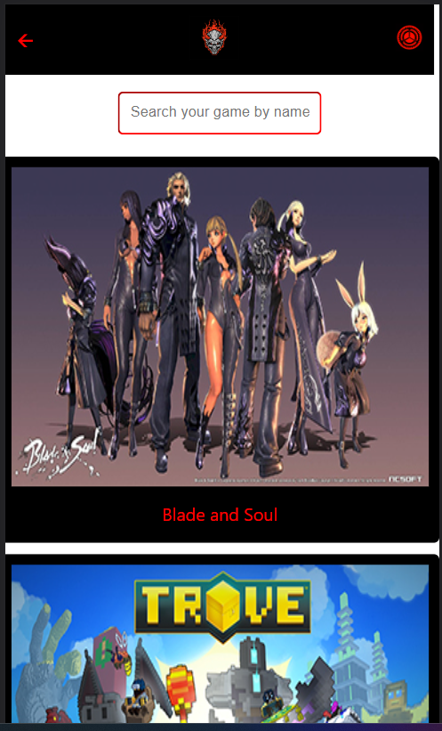

<a name="readme-top"></a>

<div align="center">
  <h1><b>FREE TO PLAY API</b></h1>
  
</div>

# 📗 Table of Contents

- [📗 Table of Contents](#-table-of-contents)
- [ 💻 FREE TO PLAY ](#-free-to-play-)
  - [🛠 Built With ](#-built-with-)
    - [Tech Stack ](#tech-stack-)
    - [Key Features ](#key-features-)
  - [🚀 Live Demo ](#-live-demo-)
  - [💻 Getting Started ](#-getting-started-)
    - [Prerequisites](#prerequisites)
    - [Setup](#setup)
    - [Install](#install)
    - [Usage](#usage)
  - [👥 Author ](#-author-)
  - [How to access the database?](#how-to-access-the-database)
  - [🤝 Contributing ](#-contributing-)
  - [⭐️ Show your support ](#️-show-your-support-)
  - [🙏 Acknowledgments ](#-acknowledgments-)
  - [📝 License ](#-license-)

# 💻 FREE TO PLAY <a name="about-project"></a>

> **FREE TO PLAY** is a Microverce React capstone project where the user can look for free to play games.

## 🛠 Built With <a name="built-with"></a>

### Tech Stack <a name="tech-stack"></a>

> I used React, Javascript to build this project.

<details>
  <summary>Client</summary>
  <ul>
    <li>React</li>
    <li>Redux</li>
    <li>JAVASCRIPT</li>
    <li>Html</li>
    <li>CSS</li>
  </ul>
</details>

### Key Features <a name="key-features"></a>

> Some key feature of this project
> Features

- **User can look for free games available to play**
- **User can check out details about a specific game**

<p align="right">(<a href="#readme-top">back to top</a>)</p>

## 🚀 Live Demo <a name="live-demo"></a>
 ### [Live Demo](https://freetoplaygames.onrender.com)

## Project demo
### [Project demo] (https://www.loom.com/share/f29d57fffb3e44058b60714c5435e031)

<p align="right">(<a href="#readme-top">back to top</a>)</p>

## 💻 Getting Started <a name="getting-started"></a>

> Please follow the instructions to clone the repo
> To get a local copy, follow these simple example steps.
> Clone this repository or download the Zip folder:

### Prerequisites

> In order to check the linters errors and also see the project in your local machine make sure you have installed the [nodejs](https://nodejs.org)

### Setup

> Clone this repository to your desired folder: cd [folder] to navigate and run the below comand to clone the project

```sh
git clone https://github.com/bill7pearl/react-capstone.git
```

### Install

Install this project with:

download npm the packages

```sh
npm install
```

To download the dev dependency you have to type this command:

```sh
npm i --save-dev
```

### Usage

> To see the project in your local browser first of all, go to project file and navigate the directory on your terminal and type below command:

```sh
npm start
```

> After start the dev server a new tab will be open your browser.

> To build this project you have to run the below command:

```sh
npm run build
```

<p align="right">(<a href="#readme-top">back to top</a>)</p>

## 👥 Author <a name="authors"></a>

👤 **Billal Chami**

- GitHub: [@githubhandle](https://github.com/bill7pearl)
- Twitter: [@twitterhandle](https://twitter.com/BillChami)
- LinkedIn: [LinkedIn](https://www.linkedin.com/in/billal-chami-263497194/)

<p align="right">(<a href="#readme-top">back to top</a>)</p>

## 🔭 Future Features <a name="future-features"></a>

- [ ] **I will add api call to make CRUD operation with games list**
- [ ] **I will develop Categories Page**

<p align="right">(<a href="#readme-top">back to top</a>)</p>

## 🤝 Contributing <a name="contributing"></a>

Contributions, issues, and feature requests are welcome!

Feel free to check the [issues page](../../issues/).

<p align="right">(<a href="#readme-top">back to top</a>)</p>

## ⭐️ Show your support <a name="support"></a>

> Give a ⭐️ if you like this project!

<p align="right">(<a href="#readme-top">back to top</a>)</p>

## 🙏 Acknowledgments <a name="acknowledgements"></a>

> Without Microverse Help this project would not be completed so thanks a lot Microverse for giving me this opportunity.
> I also I would like to thank Nelson Sakva for Original Design Official [Behance](https://www.behance.net/) Page point_right [@NelsonSakva](https://www.behance.net/sakwadesignstudio).

<p align="right">(<a href="#readme-top">back to top</a>)</p>

## 📝 License <a name="license"></a>

This project is [MIT](./LICENSE) licensed.

<p align="right">(<a href="#readme-top">back to top</a>)</p>
